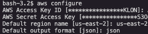
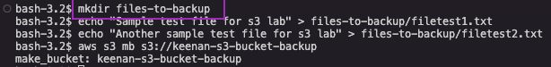
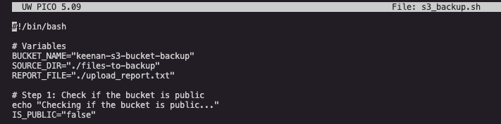
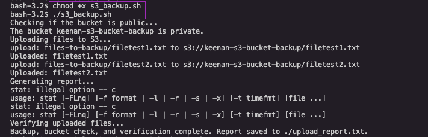
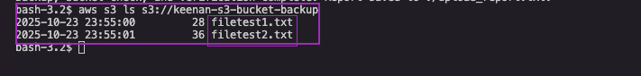
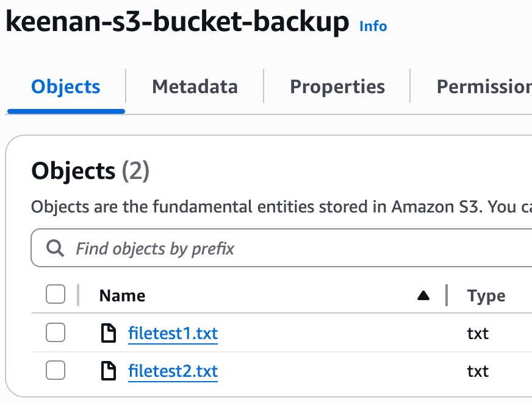

# AWS S3 Backup Script Project

A bash script that automates file uploads to Amazon S3 with security checks and verification reporting.

## 🎯 Project Overview

This project demonstrates AWS CLI proficiency, bash scripting skills, and cloud storage automation. The script uploads local files to an S3 bucket while performing security checks and generating detailed reports. I enjoyed this and wish to continue my learning.

## 🏗️ Architecture Diagram


The diagram illustrates the complete workflow:
- **User Environment**: Local bash script execution
- **AWS CLI**: Interface for S3 operations
- **S3 Bucket**: Target storage with security configuration
- **Reporting**: Automated metadata and verification reports

## 📁 Project Structure

```
├── README.md              # This documentation
├── s3_backup.sh           # Main backup script
├── files-to-backup/       # Directory containing files to upload
│   ├── filetest1.txt        # Sample test file for s3 lab
│   ├── filetest2.txt        # Another sample test file for s3 lab
└── upload_report.txt      # Generated report (after script execution)
```

## 🚀 Setup Process

### 1. AWS Configuration
- Created IAM user with programmatic access
- Generated Access Key and Secret Key for AWS CLI authentication
- Configured AWS CLI with credentials and region

*AWS CLI configuration with credentials and region setup*




### 2. Project Setup
- Created directory called `files-to-backup`
- Added sample text files for testing
- Created S3 bucket: `keenan-s3-bucket-backup`
  
*Creating the files-to-backup directory structure*




### 3. Script
- Saved the script using `nano s3_backup.sh`
- Made script executable: `chmod +x s3_backup.sh`
- Executed the script and verified results
  
*Saving the backup script with nano*




*Making the script executable with chmod +x s3_backup.sh*




### 4. Verification
- Checked S3 bucket to confirm files were uploaded successfully
- Reviewed generated report for upload verification
*Verifying uploaded files using AWS CLI*



*Confirming file uploads in the AWS S3 console*




## 📋 Script Features

### Security Checks
- ✅ Bucket ACL analysis for public access
- ✅ Bucket policy evaluation
- ✅ Public/private status reporting

### File Operations
- ✅ Directory existence validation
- ✅ File presence verification
- ✅ Batch file upload to S3
- ✅ Upload progress tracking

### Reporting
- ✅ Detailed upload report generation
- ✅ File size documentation
- ✅ S3 verification results
- ✅ Success/failure status

### Error Handling
- ✅ Missing directory detection
- ✅ Empty directory validation
- ✅ File-only processing (excludes subdirectories)
- ✅ Clear error messages

## 🔧 Script Code

```bash
#!/bin/bash

# =============================================================================
# S3 Backup Script with Security Check
# Purpose: Upload files to S3, check bucket security, and generate reports
# =============================================================================

# Variables
BUCKET_NAME="keenan-s3-bucket-backup"
SOURCE_DIR="./files-to-backup"
REPORT_FILE="./upload_report.txt"

# Step 1: Check if the bucket is public
echo "Checking if the bucket is public..."
IS_PUBLIC="false"

# Check bucket ACL for public access
if aws s3api get-bucket-acl --bucket "$BUCKET_NAME" | grep -q 'http://acs.amazonaws.com/groups/global/AllUsers'; then
    IS_PUBLIC="true"
fi

# Check bucket policy for public access
if aws s3api get-bucket-policy --bucket "$BUCKET_NAME" 2>/dev/null | grep -q '"Effect": "Allow"'; then
    if aws s3api get-bucket-policy --bucket "$BUCKET_NAME" 2>/dev/null | grep -q '"Principal": "*"'; then
        IS_PUBLIC="true"
    fi
fi

# Report bucket security status
if [ "$IS_PUBLIC" == "true" ]; then
    echo "The bucket $BUCKET_NAME is public." | tee -a "$REPORT_FILE"
else
    echo "The bucket $BUCKET_NAME is private." | tee -a "$REPORT_FILE"
fi

# Step 2: Check if source directory exists
if [ ! -d "$SOURCE_DIR" ]; then
    echo "Error: Source directory $SOURCE_DIR does not exist!"
    echo "Please create the directory and add files to backup."
    exit 1
fi

# Check if directory has files
if [ ! "$(ls -A "$SOURCE_DIR")" ]; then
    echo "Error: Source directory $SOURCE_DIR is empty!"
    echo "Please add files to backup."
    exit 1
fi

# Upload files to S3
echo "Uploading files to S3..."
for file in "$SOURCE_DIR"/*; do
    if [ -f "$file" ]; then
        aws s3 cp "$file" "s3://$BUCKET_NAME/"
        echo "Uploaded: $(basename "$file")"
    fi
done

# Step 3: Generate report
echo "Generating report..."
echo "Uploaded Files Report" > "$REPORT_FILE"
echo "=====================" >> "$REPORT_FILE"

for file in "$SOURCE_DIR"/*; do
    if [ -f "$file" ]; then
        FILENAME=$(basename "$file")
        FILESIZE=$(stat -c%s "$file")
        echo "File: $FILENAME, Size: $FILESIZE bytes" >> "$REPORT_FILE"
    fi
done

# Step 4: Verify files in S3
echo "Verifying uploaded files..."
echo "" >> "$REPORT_FILE"
echo "Verification Results" >> "$REPORT_FILE"
echo "=====================" >> "$REPORT_FILE"

for file in "$SOURCE_DIR"/*; do
    if [ -f "$file" ]; then
        FILENAME=$(basename "$file")
        if aws s3 ls "s3://$BUCKET_NAME/$FILENAME" > /dev/null 2>&1; then
            echo "$FILENAME exists in S3." >> "$REPORT_FILE"
        else
            echo "$FILENAME is missing in S3!" >> "$REPORT_FILE"
        fi
    fi
done

echo "Backup, bucket check, and verification complete. Report saved to $REPORT_FILE."
```

## 🏃‍♂️ How to Run

### Prerequisites
- AWS CLI installed and configured
- IAM user with S3 permissions
- Bash shell environment

### Execution Steps
```bash
# 1. Make script executable
chmod +x s3_backup.sh

# 2. Run the script
./s3_backup.sh

# 3. Check the generated report
cat upload_report.txt
```

## 📊 Sample Output

```
Checking if the bucket is public...
The bucket keenan-s3-bucket-backup is private.
Uploading files to S3...
Uploaded: filetest1.txt
Uploaded: filetest2.txt
Generating report...
Verifying uploaded files...
Backup, bucket check, and verification complete. Report saved to ./upload_report.txt.
```

## 📸 Project Walkthrough

The images above demonstrate the complete project workflow from setup to verification, showing:

✅ **AWS CLI Configuration** - Credential setup  
✅ **Directory Structure** - Organized file management  
✅ **Scripting** - Practical bash scripting  
✅ **Permission Management** - Security best practices  
✅ **Verification Process** - Both CLI and console validation  

This visual documentation proves hands-on experience with AWS services and automation scripting.

## 📈 Generated Report Example

```
Uploaded Files Report
=====================
File: filetest1.txt, Size: 156 bytes
File: filetest2.txt, Size: 89 bytes

Verification Results
=====================
filetest1.txt exists in S3.
filetest2.txt exists in S3.
```

## 🔐 AWS Resources Used

### IAM Configuration
- **User**: Programmatic access user
- **Permissions**: S3 read/write access
- **Authentication**: Access Key + Secret Key

### S3 Configuration
- **Bucket Name**: `keenan-s3-bucket-backup`
- **Region**: `us-east-2`
- **Security**: Private bucket (verified by script)

## 🛡️ Security Features

- **Bucket Privacy Check**: Automatically detects public bucket configurations
- **ACL Analysis**: Examines bucket access control lists
- **Policy Evaluation**: Reviews bucket policies for public access
- **Security Reporting**: Documents security status in report

## 🎯 Skills Demonstrated

- **AWS CLI Proficiency**: S3 operations and API calls
- **Bash Scripting**: Advanced shell scripting techniques
- **Error Handling**: Robust validation and error management
- **Security Awareness**: Bucket security assessment
- **Automation**: Streamlined backup and verification process


This project demonstrates practical AWS skills and automation capabilities for cloud storage management.

---

*Built with AWS CLI, Bash scripting, and cloud security best practices*
